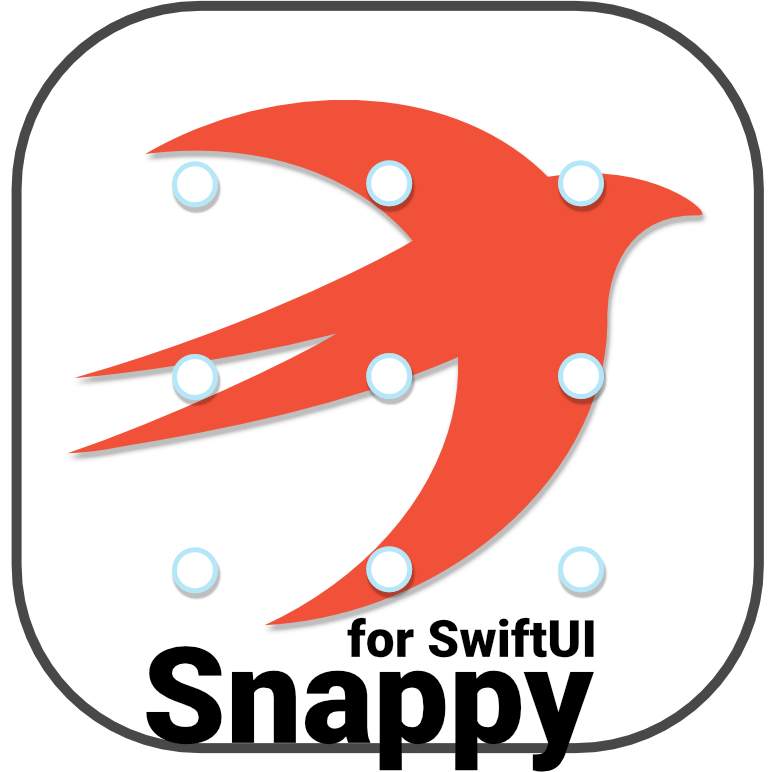

#Snappy

Snappy is a SwiftUI component that allows you to create draggable views with snapping functionality to specified points. It’s highly customizable and easy to integrate into your SwiftUI projects.

## Features

* Draggable Content: Wrap any SwiftUI view to make it draggable within a specified coordinate space.
* Snap Points: Define custom snap points where the content will automatically align after dragging.
* Customization: Control the coordinate space, snap points, and initial position of the draggable content.

## Installation

You can add Snappy to your project using Swift Package Manager.
* Open your project in Xcode.
* Go to File > Add Packages…
* Enter the repository URL: https://github.com/owlcoding/Snappy.git
* Select the version you want to install.
* Add the package to your project.

## Usage

### Here’s how you can use Snappy in your SwiftUI application:

```swift
import SwiftUI
import Snappy

struct ContentView: View {
    @State private var translation: CGSize = .zero

    var body: some View {
        VStack {
            Button("Reset") { translation = .zero }
                .buttonStyle(BorderedProminentButtonStyle())
            Text("Position: \(translation)")
                .animation(.default, value: translation)
            SnappyView(rememberedTranslation: $translation) {
                Image(systemName: "music.note")
                    .font(.system(size: 60))
                    .foregroundColor(.accentColor)
                    .frame(width: 150, height: 50)
                    .background(
                        RoundedRectangle(cornerRadius: 30)
                            .fill(Color.tertiary.opacity(0.8))
                    )
            }
        }
    }
}
```

### Customizing Snap Points

You can specify custom snap points using the `snapPoints` parameter:

```swift
SnappyView(
    rememberedTranslation: $translation,
    snapPoints: [.topLeading, .bottomTrailing]
) {
    // Your content here
}
```

### Coordinate Space

By default, `SnappyView` uses the `.local` coordinate space. You can change it using the coordinateSpace parameter:

```swift
SnappyView(
    coordinateSpace: .global,
    rememberedTranslation: $translation
) {
    // Your content here
}
```

### Parameters

* `coordinateSpace`: The coordinate space used for drag gestures. Defaults to .local.
* `rememberedTranslation`: A Binding to a CGSize that keeps track of the translation between interactions.
* `snapPoints`: A set of UnitPoint values where the view will snap after dragging ends. Defaults to all corners and edges.
* `content`: A closure that provides the draggable content.

## Example project

An example project is included in the repository to demonstrate how to use Snappy. Check out the Example directory to see it in action.


## Contributing

Contributions are welcome! Feel free to open an issue or submit a pull request.

## License

This project is licensed under the MIT License.

## Support

If you find this library helpful and would like to support its development, feel free to [buy me an apple 🍏](https://buymeacoffee.com/owlcoding). Every bit of support helps fuel future updates and enhancements!


_Happy Coding!_
